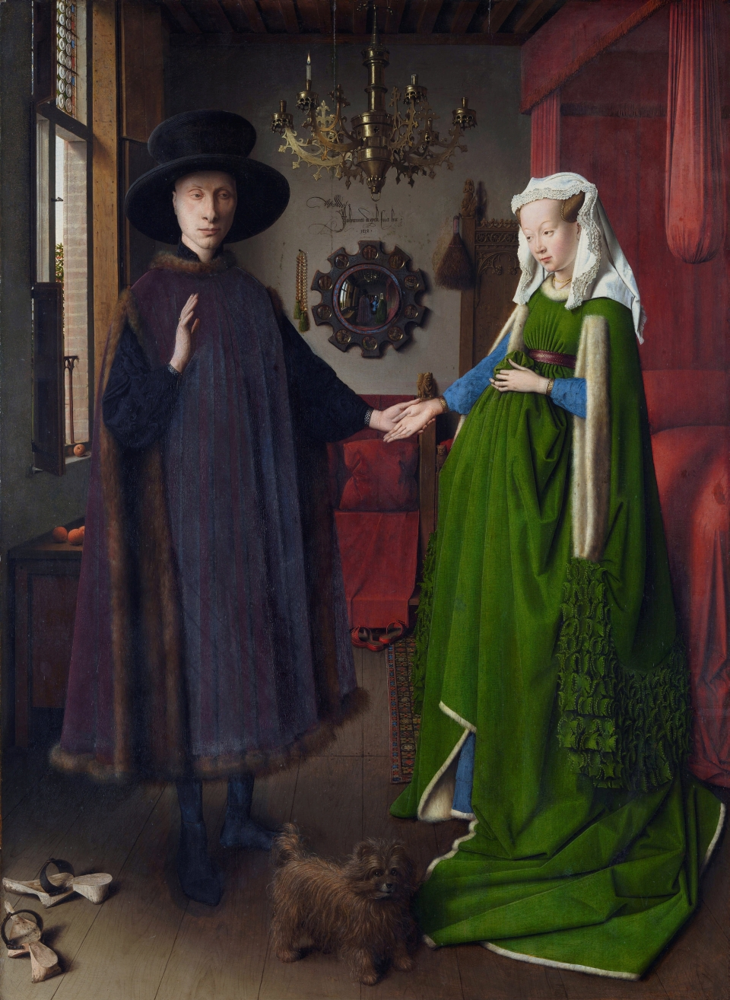
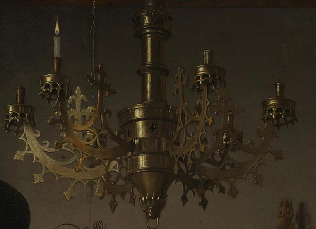

# Portrait of Arnolfini and his Wife

> 阿尔诺菲尼夫妇

## 1. Profile

| Key                      | Value                |
| ------------------------ | -------------------- |
| 藝術家                   | 揚·范·艾克           |
| 年份                     | 1434年               |
| 類型                     | 油彩、橡木           |
| 尺寸                     | 81.8cm x 59.7cm      |
| 收藏地                   | 英國國家美術館，倫敦 |
| 欣赏要点|细节+隐藏            |

## 2. Content

画面记录的是一位意大利富商：**乔凡尼·阿尔诺芬尼**（Giovanni Arnolfini）和他19岁的新婚妻子**琼妮·德·切纳米**的婚礼场面。

阿尔诺芬尼是当时有名的卢卡商人兼银行家，来自托斯卡纳，依靠他强大而富有家族，在1420年被菲力普公爵封为骑士。他以经营佛罗伦萨的丝绸、贵重的挂毯等“奢侈品”为生，一生大部分时间都居住在尼德兰。作为商人，这大概是他一生中最有价值的投资了：让自己的形象与名字载入史书中。

- 中心：人物、镜子
- 左侧：窗户、
- 右侧：床褥
- 上方：吊灯
- 下方：木鞋、小狗 

### 2.1 中心：人物

- 手足
- 头部
- 衣着

#### 2.1.1 手足

画中上，阿尔诺芬尼与新婚的妻子执手相向而立，乔凡尼用左手握着妻子的右手，右手将要放在她的右手上去，这一动作代表着这对男女正在宣誓。这种姿势联想一下“执子之手，与子偕老”，则可能更好理解。

> 画面中间，两个人通过手进行连接。

阿尔诺芬尼的妻子左手位于腹部，再看其肚子似乎是隆起的，一种说法是她已怀孕，据尼德兰婚姻风俗：男子与女子先订婚，然后同居，等女子肚子隆起，认为具备生育能力后，方可正式结婚；另一种说法是该女子并未怀孕，出现肚子隆起的现象，只是因为穿了件当时比较时髦的服装——“高腰蓬裙”所带来的效果。

> 画面中阿尔诺芬尼的妻子左手

画中人都脱了鞋，代表圣洁，暗示正进行神圣仪式，即结婚。小狗旁边，前景左边有一双新郎的木鞋，而新娘的小红鞋被放置在后边，有一种解读认为是这对夫妇正在进行婚礼，站在神圣的土地上，因而丢掉了他们的鞋子，即《圣经》的经文：“把鞋子从脚边挪开，因为脚下是神圣的土地。”

#### 2.1.2 头部

阿尔诺芬尼头戴高顶圆边礼帽，身披黑色斗篷，表情庄严。

> 左侧人物

这样的形象曾使美国导演詹姆斯·麦克特格（James McTeigue）得到灵感，创造了电影《V字仇杀队》( V for Vendetta）中主人公的“V”型面具形象。

阿尔诺芬尼的妻子头戴白色头巾，代表纯洁、坚贞；身着绿裙，代表生育。

> 右侧人物

#### 2.1.3 衣着

作为一对商人夫妻，阿尔诺菲尼夫妇**华丽的衣着**显示二人**经济状况非常优渥**。

阿尔诺芬尼头戴高顶圆边礼帽，身披黑色斗篷。

> 左侧人物

阿尔诺芬尼的妻子头戴白色头巾，代表纯洁、坚贞；身着绿裙，代表生育。长袍上领口和袖口的皮草，一根根绒毛清晰可见，柔软温暖的手感似乎能透过画作传递给观者。

> 右侧人物

### 2.2 中心：镜子

画作中最精彩的看点来源于背后墙上的镜子。

镜子上方：

镜子上方刻着他的名字“Jan van Eyck was here 1434”，即“1434 年杨·凡·艾克在此”。

镜子中心：

圆凸镜是画面的聚焦点，它拓展了画面的空间，画中套画，如同叙事文学中的大故事套小故事，增强了画作的丰富性和趣味性。

画面中的关键细节是乔万尼·阿尔诺芬尼夫妇身后的那面**圆凸镜**。在这幅画里我们很容易看到这面镜子，因为它是整幅画面构图的中心所在。仔细观察镜子中的内容，镜子清晰的映衬出夫妇二人的背影，连衣服上的褶皱都清晰可见。我们会发现除了阿尔诺芬尼夫妇之外，还有两个人，一个是画家扬·凡·艾克本人，另一个则是一名年轻人，或许只是一名婚礼的见证人。

这是一面凸面镜，因此镜中左右两侧的窗户及红色大床的影像都发生了一定的扭曲，扬·凡·艾克在方寸之间把这种扭曲处理得如此精细传神，叹为观止。

为了保持这个“结婚证”的权威，艺术家不但身在场证明，也将自己放入画中，画面后方的镜子成为点睛之笔，反射出艺术家本人的身着红衣的模糊身影，蓝衣被认为是教堂的主教。

镜子边缘：

此外，镜子的边缘，是十个圆形的画中画，里面细致的刻画着十个《圣经》故事，其中八副为耶稣受难，另外两幅描绘了耶稣复活的场景。精细入微，连摄影师看了都叹为观止。

总结

镜子中的两个人物以及镜子上方作者拉丁文式的签名（即“扬·凡·艾克在此”），都是为了见证这场婚姻的合法有效性。画中还隐含着“镜子”的象征意义，在西方象征文化中“镜子”被解读为“真理”，意思就是不说谎。

### 2.3 左侧：窗户

画面左上角窗外有象征爱情的樱桃树，由樱桃树的果实和高度判断，画面所表现的时间为夏天，两人房间的位置位于楼上的某层，并且该房间不是我们通常所认为的卧室，而是一间接待室；

窗台以及柜子上的橘子象征伊甸园般的纯洁和天真，亦是代表财富，因为在当时橘子是从意大利进口到尼德兰的高档水果，只有富人家庭才能买得起。

### 2.4 右侧：床褥

猩红的床褥象征生活和谐笑满；床头往上有象征怀孕、分娩的圣玛格丽特的形象

拉开的床幔，而床柱上雕着的“圣玛格丽特战胜龙”的形象，也是在当时作为生育的象征。

顺着床头柱往左可以看到，镜子的两侧分别挂着玫瑰念珠和刷子，暗示着这是一场天主教式的婚礼。

### 2.5 上方：吊灯

在两人头顶上方，朗朗白日之下却留有一根点燃的蜡烛，象征上帝之眼，上帝见证婚姻的有效性和神圣性。

以画面中的光线而言，是不需要点蜡烛的，但在画面上方，唯一的一根蜡烛却被点燃，也是当时尼德兰的婚俗之一，被解读为“通向天堂的光明”。同样有着宗教含义的是镜子旁的念珠， 这被认为是代表着夫妻对上帝的虔诚，床旁边的刷帚意味着纯洁。

### 2.6 下方：小狗

华丽的衣着之下，一只小狗带着湿润的眼睛将勃勃生气展现给观者。小狗则象征忠诚，它被认为象征着夫妻双方对彼此的忠诚，或可以看作是愿望的象征，标志着夫妻想有个孩子的愿望。

小狗，也一直被人们所津津乐道，狗毛根根分明，质感、颜色及动态也描绘的极为传神，很难想象这样一只小狗居然是用画笔一笔笔画出来的。

## 3. 宗教信仰

除了富有，这对夫妇还是虔诚的基督教徒，这一点可以从画中多处得到印证：

1） 镜框四周的基督教迷你装饰画。

2） 镜子左侧墙上挂着祷告用的珠串。

3） 房间上方华丽的吊灯上，有很多插蜡烛的地方，却只有一支燃烧的蜡烛，寓意唯一的真神上帝在天堂注视着人间的一切。

画中的吊灯，英文表述是chandelier，但chandelier不是一般意义上的吊灯，是树枝形的华贵的吊灯，比如饭店大堂或某些土豪家里的水晶大吊灯

## 4. 评价

这可能是艺术史上最为著名的“婚纱照”了。

但美的发现绝不仅于此，用自己的心去亲自感受、用自己的大脑去独立思考，每个人都会发现一个不一样的阿尔诺菲尼夫妇。

